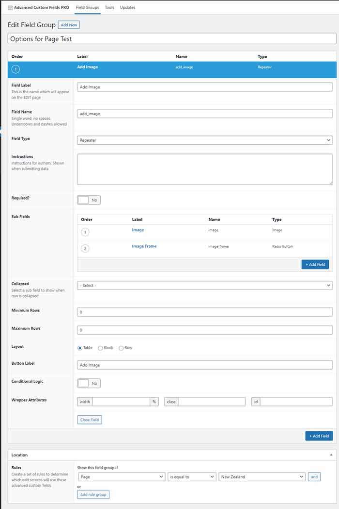
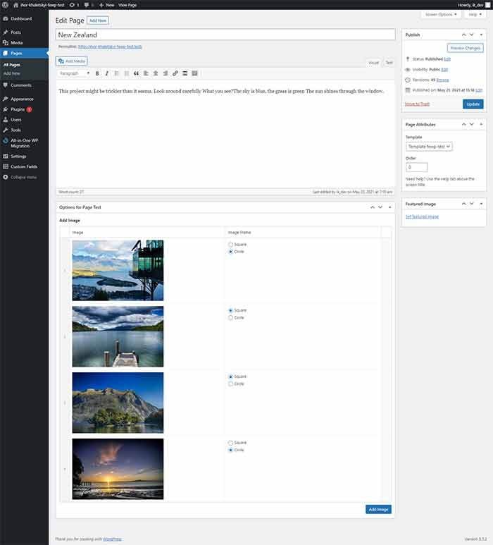
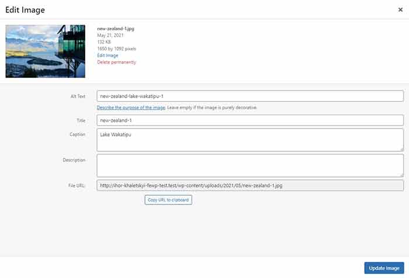
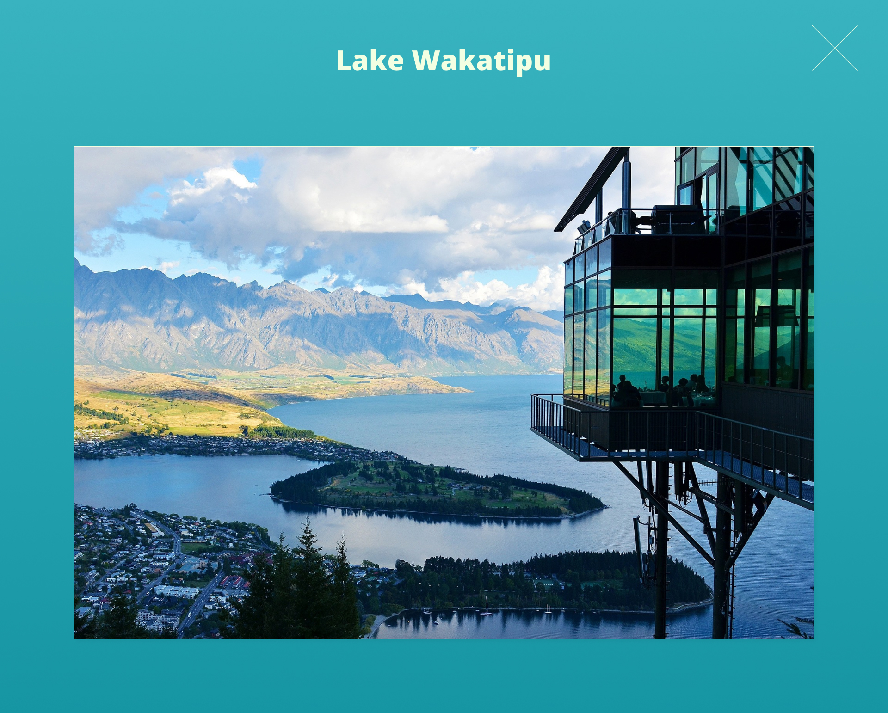
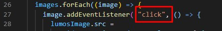
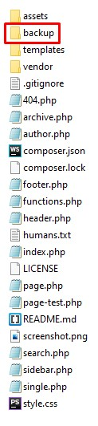

# Timber Starter Theme is customized by Ihor Khaletskyi
## The templates folder contains:
1. base.twig
2. footer.twig
3. html-header.twig
4. page-test.twig
##### The page-test.php was added as a template called 'Template fewp-test' to the Theme folder.
##### The New Zealand-Front page was created using 'Template fewp-test'. 
##### Timber library was installed via Composer.
##### The assets folder contains the files .js .css .scss, .zip, .sql, images. 
##### Advanced Custom Field Pro is needed for launching the created functionality .

##### The New Zealand-Front page was created using 'Template fewp-test'.

##### The design is converted and maked  it responsive. Main compare point is the 1920px resolution.

##### The overlay is appeared by click event. The 'click' event can be changed to 'mouseenter' (hover effect) event in the file lumos.js.

### To install the WordPress website 'http://ihor-khaletskyi-fewp-test.test'  with full functionality, you can use the files 'ihor-khaletskyi-fewp-test.zip' and 'ihor-khaletskyi-fewp-test.sql' from the backup folder. 
##### http://ihor-khaletskyi-fewp-test.test/wp-admin 
1. login: ik_dev
2. password: 123

# The Timber Starter Theme

The "_s" for Timber: a dead-simple theme that you can build from. The primary purpose of this theme is to provide a file structure rather than a framework for markup or styles. Configure your Sass, scripts, and task runners however you would like!

## Installing the Theme

Install this theme as you would any other, and be sure the Timber plugin is activated. But hey, let's break it down into some bullets:

1. Make sure you have installed the plugin for the [Timber Library](https://wordpress.org/plugins/timber-library/) (and Advanced Custom Fields - they [play quite nicely](https://timber.github.io/docs/guides/acf-cookbook/#nav) together). 
2. Download the zip for this theme (or clone it) and move it to `wp-content/themes` in your WordPress installation. 
3. Rename the folder to something that makes sense for your website (generally no spaces and all lowercase). You could keep the name `timber-starter-theme` but the point of a starter theme is to make it your own!
4. Activate the theme in Appearance >  Themes.
5. Do your thing! And read [the docs](https://timber.github.io/docs/).

## What's here?

`static/` is where you can keep your static front-end scripts, styles, or images. In other words, your Sass files, JS files, fonts, and SVGs would live here.

`templates/` contains all of your Twig templates. These pretty much correspond 1 to 1 with the PHP files that respond to the WordPress template hierarchy. At the end of each PHP template, you'll notice a `Timber::render()` function whose first parameter is the Twig file where that data (or `$context`) will be used. Just an FYI.

`bin/` and `tests/` ... basically don't worry about (or remove) these unless you know what they are and want to.

## Other Resources

* [This branch](https://github.com/laras126/timber-starter-theme/tree/tackle-box) of the starter theme has some more example code with ACF and a slightly different set up.
* [Twig for Timber Cheatsheet](http://notlaura.com/the-twig-for-timber-cheatsheet/)
* [Timber and Twig Reignited My Love for WordPress](https://css-tricks.com/timber-and-twig-reignited-my-love-for-wordpress/) on CSS-Tricks
* [A real live Timber theme](https://github.com/laras126/yuling-theme).
* [Timber Video Tutorials](http://timber.github.io/timber/#video-tutorials) and [an incomplete set of screencasts](https://www.youtube.com/playlist?list=PLuIlodXmVQ6pkqWyR6mtQ5gQZ6BrnuFx-) for building a Timber theme from scratch.

